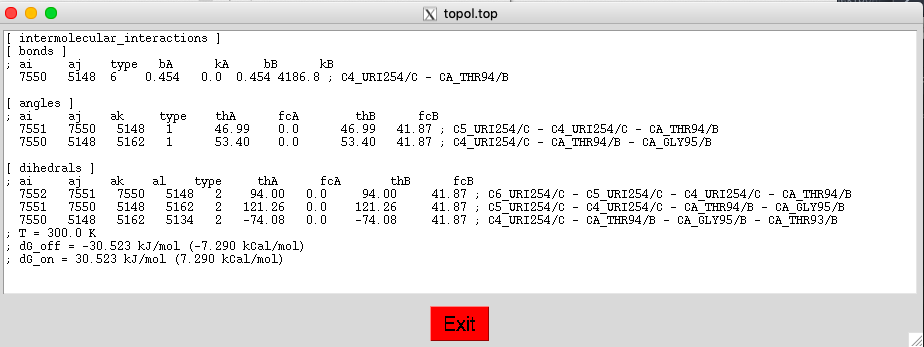

PyFepRestr
================================================
## Plug-in for PyMol molecular graphics system

Short Description
-----------------
PyFepRestr is a plug-in designed to set restraints on ligand atoms in the active center of a protein, as suggested by Boresch et al. \[1]  and used in free energy calculations with the Gromacs molecular dynamics program [2]. The plug-in allows you to determine from the coordinates of three ligand atoms and three protein atoms, the inter-atomic distance, the two angles between bonds and the three dihedral angles used in the Boresch formula  as well as write their values to the Gromacs topology file. The coordinates of the protein-ligand complex can be obtained either experimentally using X-ray crystallography or NMR, or by modeling, for example, docking. At the beginning of the work, it is necessary to indicate in Table 1 the values of the force constants and temperatures necessary for calculating the free energy corrections according to the Boresch formula \[1].


Then, in the visualization window of the PyMol [3] structure, it is necessary to select using the “mouse” manipulator three ligand atoms and three protein atoms, to which restrictions should be applied.

In window 2, the value of the correction to the free energy arising due to restraints will be displayed,                

and you will be asked to save the force constants in the Gromacs topology file.

After that you can see the visualization in PyMol of distance, angles and dihedral angles.


Theory
------------------
The use of restraints is important in Alchemical Free Energy calculations as it prevents the ligand from leaving the protein binding pocket while it is not interacting with the environment \[4]. The set of restraints, proposed by Boresch et al. \[1], not only allows to keep the ligand in a specific orientation relative to the binding pocket, but also provides an analytical solution for corresponding ΔG component. This set of restraints needs to be harmonic and is comprised by one distance, two angles, and three dihedral angles, to be applied between three atoms of the ligand and three of the protein, as shown in Fig.1


The protein-ligand contribution in  ΔG  needs to be estimated via simulations, running multiple intermediate states where the force constants of the six harmonic restraints are interpolated between their chosen value and zero. On the other hand, ΔG related to restraints of ligand may be calculated analytically using the following formula (Eq. 32 in Boresch et al. \[1]), which also includes the standard state correction:


where V° is the standard volume of 1660 Å<sup>3</sup>, r<sub>aA</sub> is the reference value chosen for the distance restraint, θ<sub>a</sub> and θ<sub>A</sub> are the reference values of the two angle restraints, and all values of k are the force constants of the harmonic restraints for the one distance (r<sub>aA</sub>), two angle (θ<sub>a</sub> and θ<sub>A</sub>), and three dihedral (φ<sub>ba</sub>, φ<sub>aA</sub>, and φ<sub>AB</sub>) restraints.

Protein–ligand restraints can now be applied in Gromacs through the use of the [intermolecular_interactions] section at the very end of the topology file \[4]. In this section, it is possible to define bonded terms between  atoms of the system using global indices (i.e., the indices were found in the coordinates file). To generate harmonic restraints, bonds of type 6, angles of type 1, and dihedrals of type 2, can be used (see Table 5.5 in the Gromacs manual) as shown in the example below.

Example:

```
[ intermolecular_interactions]
[ bonds ]
; ai    aj    type    bA    kA    bB    kB
   3     4       6    0.5   0.0   0.5   4184.0  

[ angles ]
; ai    aj    ak    type    thA    kA    thB    kB
   2     3     4       1    80.0   0.0   80.0   41.84
   3     4     5       1    30.0   0.0   30.0   41.84  

[ dihedrals ]
; ai    aj    ak   al    type    phiA    kA    phiB    kB
   1     2     3    4       2   -100.0   0.0  -100.0   41.84
   2     3     4    5       2    120.0   0.0   120.0   41.84
   3     4     5    6       2     15.0   0.0    15.0   41.84
```


Installation and Removed
============
### Installation
To install  plugin, open PyMOL and then go to 
>**Plugin -> Plugin Manager -> Install New Plugin**


You will have the options to install from a file on your computer (*.py, *.zip) or  directly from the GitHub by providing the url of repository.


### Uninstallation
To uninstall plugin you need to go to 
>**Plugin -> Plugin Manager -> Installed Plugins**

Then you need find **PyFepRestr** and click on the button **Uninstall**.  


After that choose **Yes**


**Important point is the restart PyMol, after deleting the plugin.**

### Legacy Notes
#### MacPyMOL
MacPyMOL was the native macOS version of PyMOL before version 2.0. It supported Plugins only in the [X11 Hybrid mode](https://pymolwiki.org/index.php/MAC_Install#X11_Hybrid).

#### Installation for PyMol 2.X
After following the above instructions, you need to search the plugin in **Plugin -> Legacy Plugin -> PyFepRestr**.


[Here](https://pymolwiki.org/index.php/Plugins) you can find  more information for installation on your version PyMol.


Software Requirement
----------

To install and use the plugin you need to have version PyMol 1.5.0.6 or later. This plugin can work with PyMol 2.X  Also you need to have version Gromacs 2016 series or later. Download new version [PyMol](https://pymol.org/2/?#download) and [Gromacs](http://manual.gromacs.org/documentation/).  


References
----------
1. Boresch S, Tettinger F, Leitgeb M, Karplus M. Absolute Binding Free Energies: A Quantitative Approach for Their Calculation. *J. Phys. Chem. B* 2003, 107, 35, 9535-9551
2. van der Spoel, et al. (2005). *J. Comput. Chem.* **26:** 1701-1718.
3. DeLano, W. L. (2002). PyMOL. DeLano Scientific, San Carlos, CA, 700.
4. Aldeghi M, Bluck JP, Biggin PC. Absolute Alchemical Free Energy Calculations
     for Ligand Binding: A Beginner's Guide. *Methods Mol Biol.* 2018;1762:199-232

